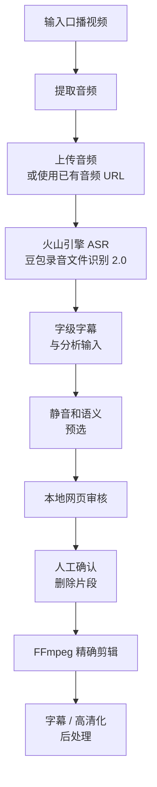
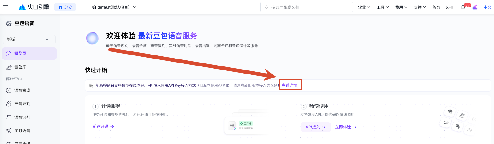
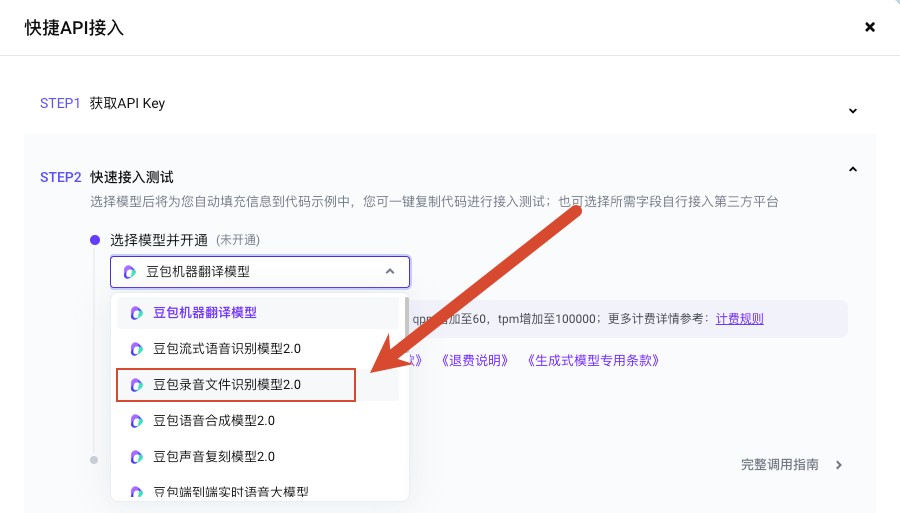
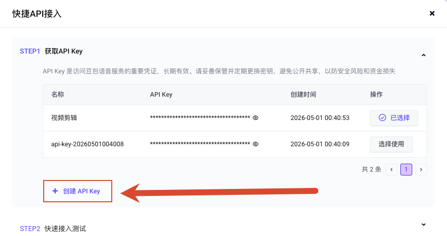

# Videocut Skills

> 面向口播视频的 Codex / Claude Code Skills 剪辑流水线。  
> 从语音转录、热词纠错、口误识别、网页审核到 FFmpeg 精确剪辑，帮助创作者把长口播素材快速整理成可发布版本。

[](LICENSE)
[](https://github.com/Ceeon/videocut-skills)
[](https://console.volcengine.com/speech/new/overview)
[](https://nodejs.org/)
[](https://ffmpeg.org/)

[为什么做这个](#为什么做这个) · [功能特性](#功能特性) · [快速开始](#快速开始) · [火山引擎配置](#火山引擎配置) · [使用流程](#使用流程) · [项目结构](#项目结构) · [许可](#许可)

## 项目定位

`videocut-skills` 是一组面向 AI Agent 的本地 Skills，目标不是做一个完整桌面剪辑软件，而是把口播剪辑里最容易重复出错的步骤沉淀成可执行流水线：

- 用火山引擎「豆包录音文件识别模型 2.0」生成带字级时间戳的转录结果。
- 用本地词典作为热词，降低个人词汇或专业词误识别概率。
- 用规则和语义分析预选静音、重复、卡顿、重说纠正和残句。
- 生成本地网页审核页，让用户最后确认要删除的片段。
- 用 FFmpeg 按审核结果输出剪辑后视频，并支持字幕和高清化后处理。

## 为什么做这个

上游原版 README 的核心定位是：用 Claude Code Skills 做一个专门服务口播视频的剪辑 Agent。本 fork 继续保留这个定位，只是把底层转录模型、主流程脚本、文档结构和隐私边界做了二次开发。

这个项目主要解决剪映「智能剪口播」在知识类、教程类、长口播场景里的两个问题：

1. 只看停顿或表层模式时，很难判断“前一句说错、后一句纠正”这种语义关系。
2. 通用字幕识别容易把产品名、技术词、人名、缩写和个人高频词识别错。

本项目的思路是：让 ASR 负责稳定产出字级时间戳，让词典/热词提升专有名词识别，让 Agent 根据口误规则和上下文语义生成可审核的删除候选，最后仍由用户在网页审核页确认。

## Fork 说明

本仓库基于 [Ceeon/videocut-skills](https://github.com/Ceeon/videocut-skills) fork 并继续改造。上游项目 README 标注为 MIT License，本 fork 继续按 MIT License 分发，并保留上游来源说明。

本 fork 的主要修改记录在 [CHANGES_FROM_UPSTREAM.md](CHANGES_FROM_UPSTREAM.md)，包括：

- 将 ASR 接口切换为火山引擎「豆包录音文件识别模型 2.0」标准版提交/查询接口。
- 实现 `字幕/词典.txt` 热词读取，并随转录请求传给火山引擎。
- 收敛剪口播主流程，新增 `剪口播/scripts/run_pipeline.sh`。
- 新增输出校验、schema 说明和样例转录 fixture。
- 抽象音频上传器，并补充第三方上传隐私说明。
- 修复网页审核页在 macOS 上按住 Shift 批量选中的交互问题。
- 完善 README、安装说明、Skill 导航和 `agents/openai.yaml` 元数据。

上游原版 README 可在 [Ceeon/videocut-skills](https://github.com/Ceeon/videocut-skills#readme) 查看；本 README 保留了原版关于剪映痛点、口播剪辑动机和核心能力对比的说明，并补充了本 fork 的新模型、新流水线和开通配置。

## 功能特性

| 模块 | 能力 | 主要产物 |
| --- | --- | --- |
| 路由 | 判断用户当前目标，引导进入安装、剪口播、字幕、高清化或自进化 | 推荐工作流和下一步动作 |
| 剪口播 | 提取音频、上传、火山转录、静音/口误/重复预选、网页审核、执行剪辑 | `volcengine_result.json`、`subtitles_words.json`、`auto_selected.json`、`delete_segments.json`、剪辑后视频 |
| 字幕 | 生成字幕、词典纠错、审核与烧录 | 字幕文件、带字幕视频 |
| 高清化 | 2-pass 编码、锐化、匹配原片参数导出 | 高清 MP4 |
| 安装 | 检查 Node.js、FFmpeg、Python 和本地依赖 | 环境检查结果 |
| 自进化 | 记录用户剪辑偏好，更新规则文件 | 用户习惯规则 |

## 与剪映智能剪口播对比

这里对比的是“知识类口播剪辑”这个具体工作流，不是对剪映完整剪辑产品能力的评测。剪映适合快速手工剪辑和成片包装；本项目更适合把长口播里的重复、纠正、卡顿和专业词处理成可追溯的 Agent 流水线。

| 能力 | Videocut Skills | 剪映智能剪口播常见体验 |
| --- | --- | --- |
| 语义理解 | 结合转录文本和规则，识别重说、纠正、残句和上下文重复 | 更偏自动化剪停顿、语气词和表层模式 |
| 静音处理 | 阈值、规则和审核结果可配置，可输出 JSON 产物 | 操作方便，但规则细节和中间产物不透明 |
| 重复句检测 | 支持相邻重复、句内重复、删前保后等口播规则 | 需要更多人工判断和时间线操作 |
| 专业词识别 | `字幕/词典.txt` 同时用于字幕纠错和火山热词 | 通用识别更方便，但个人词库控制较弱 |
| 人工审核 | 生成本地审核页，删除候选可逐条确认 | 主要在剪辑软件界面里手工调整 |
| 可追溯性 | 保留 `volcengine_result.json`、`auto_selected.json`、`delete_segments.json` 等中间产物 | 更偏成品编辑，不强调可复盘数据链路 |
| 可扩展性 | 可改脚本、规则、references 和用户习惯 | 产品化能力强，但自定义底层流程有限 |
| 高清导出 | FFmpeg 参数透明，可做 2-pass 和锐化 | 导出体验成熟，但脚本化批处理能力较弱 |

## 工作流



## 快速开始

### 1. 安装到 Skills 目录

```bash
mkdir -p ~/.codex/skills
git clone https://github.com/MingStudentSE/videocut-skills.git ~/.codex/skills/videocut-skills
cd ~/.codex/skills/videocut-skills
```

### 2. 准备环境变量

```bash
cp .env.example .env
```

编辑 `.env`，至少填入：

```bash
VOLCENGINE_API_KEY=你的_API_Key
VOLCENGINE_RESOURCE_ID=volc.seedasr.auc
VIDEO_UPLOAD_PROVIDER=uguu
```

### 3. 检查依赖

如果不确定下一步该做什么，先调用顶层路由 Skill：

```text
$videocut
```

如果已经明确是首次安装或环境检查，可以直接调用安装 Skill：

```text
$videocut:安装
```

也可以手动确认核心依赖：

```bash
node --version
ffmpeg -version
python3 --version
```

### 4. 运行剪口播流水线

在 Agent 中直接说：

```text
$videocut:剪口播 /path/to/video.mp4
```

或在命令行运行确定性入口脚本：

```bash
"./剪口播/scripts/run_pipeline.sh" "/path/to/video.mp4"
```

完成后会生成本地审核页：

```bash
node "./剪口播/scripts/review_server.js" 8899 "/path/to/video.mp4"
```

然后打开：

```text
http://localhost:8899/review.html
```

## 火山引擎配置

### 开通模型能力

1. 打开 [火山引擎豆包语音服务控制台](https://console.volcengine.com/speech/new/overview)。
2. 在「快速开始」区域点击「查看详情」，进入「快捷 API 接入」弹窗。



3. 在 `STEP2 快速接入测试` 中选择模型并开通，模型选择「豆包录音文件识别模型 2.0」。



4. 回到 `STEP1 获取 API Key`，创建 API Key 或点击已有 Key 的「选择使用」。



5. 把选中的 API Key 交给本地 Agent 配置到 `.env`。

```bash
VOLCENGINE_API_KEY=你的_API_Key
VOLCENGINE_RESOURCE_ID=volc.seedasr.auc
```

API Key 是长期有效凭证，只应保存在本地 `.env`，不要提交到 Git 或公开文档。

### ASR 接口

剪口播脚本使用火山引擎 v3 AUC 大模型录音文件识别标准版，先提交任务，再轮询结果：

```text
POST https://openspeech.bytedance.com/api/v3/auc/bigmodel/submit
POST https://openspeech.bytedance.com/api/v3/auc/bigmodel/query
X-Api-Resource-Id: volc.seedasr.auc
```

默认请求会启用字级时间戳和分句信息，以便后续生成审核页和剪辑片段。

### 环境变量

| 变量 | 说明 | 默认值 |
| --- | --- | --- |
| `VOLCENGINE_API_KEY` | 火山引擎 API Key | 必填 |
| `VOLCENGINE_RESOURCE_ID` | 火山引擎资源 ID | `volc.seedasr.auc` |
| `VOLCENGINE_SUBMIT_URL` | 转录任务提交接口 | `https://openspeech.bytedance.com/api/v3/auc/bigmodel/submit` |
| `VOLCENGINE_QUERY_URL` | 转录任务查询接口 | `https://openspeech.bytedance.com/api/v3/auc/bigmodel/query` |
| `VOLCENGINE_QUERY_INTERVAL_SECONDS` | 查询间隔 | `5` |
| `VOLCENGINE_QUERY_MAX_ATTEMPTS` | 最大查询次数 | `240` |
| `VOLCENGINE_HOTWORDS_FILE` | 热词文件路径 | `字幕/词典.txt` |
| `VIDEO_UPLOAD_PROVIDER` | 音频上传器 | `uguu` |

## 上传与隐私

默认 `VIDEO_UPLOAD_PROVIDER=uguu`，流水线会把从视频中提取出的 `audio.mp3` 上传到第三方临时文件服务，以便火山引擎通过公网 URL 拉取音频。

处理敏感素材时，建议关闭默认上传器，改用你信任的对象存储或私有上传方式：

```bash
VIDEO_UPLOAD_PROVIDER=none "./剪口播/scripts/run_pipeline.sh" "/path/to/video.mp4" \
  --audio-url "https://your-trusted-host/audio.mp3"
```

当 `VIDEO_UPLOAD_PROVIDER=none` 且没有传入 `--audio-url` 时，流水线会拒绝继续执行，避免误上传。

## 使用流程

### 路由引导

```text
$videocut 我想把这个口播视频处理成可发布版本
```

路由 Skill 会先判断你当前要做的是安装、剪口播、字幕、高清化还是规则更新，再进入对应子 Skill。新用户或目标不明确时，建议从这里开始。

### 剪口播

```text
$videocut:剪口播 /path/to/video.mp4
```

Agent 会优先运行：

```bash
"./剪口播/scripts/run_pipeline.sh" "/path/to/video.mp4"
```

生成目录结构：

```text
output/YYYY-MM-DD_视频名/剪口播/
├── 1_转录/
│   ├── audio.mp3
│   ├── audio_url.txt
│   ├── volcengine_request.json
│   ├── volcengine_result.json
│   └── subtitles_words.json
├── 2_分析/
│   ├── readable_transcript.txt
│   ├── sentences.json
│   └── auto_selected.json
└── 3_审核/
    ├── review.html
    └── delete_segments.json
```

审核页支持点击定位、双击选中、按住 Shift 批量选择和确认后执行剪辑。

### 字幕

```text
$videocut:字幕 /path/to/video.mp4
```

字幕模块会使用 `字幕/词典.txt` 做术语纠错。剪口播转录脚本也会读取同一份词典作为火山热词。

### 高清化

```text
$videocut:高清化 /path/to/video.mp4
```

高清化模块使用 2-pass 编码和锐化策略，尽量匹配或略高于原片参数输出。

### 自进化

```text
$videocut:自进化 记录这条剪辑偏好：静音超过 0.8 秒再默认删除
```

自进化模块用于把你的偏好沉淀回规则文件，让后续剪辑更符合个人习惯。

## 项目结构

```text
videocut-skills/
├── README.md
├── LICENSE
├── CHANGES_FROM_UPSTREAM.md
├── .env.example
├── SKILL.md
├── agents/openai.yaml
├── docs/
│   └── images/
│       └── volcengine-speech-api/
├── 安装/
│   ├── SKILL.md
│   └── agents/openai.yaml
├── 剪口播/
│   ├── SKILL.md
│   ├── agents/openai.yaml
│   ├── fixtures/
│   ├── references/
│   │   ├── pipeline_steps.md
│   │   ├── silence_rules.md
│   │   ├── misread_rules.md
│   │   ├── review_server.md
│   │   ├── cut_encoding.md
│   │   ├── data_formats.md
│   │   └── schemas.md
│   ├── scripts/
│   │   ├── run_pipeline.sh
│   │   ├── upload_audio.sh
│   │   ├── volcengine_transcribe.sh
│   │   ├── generate_subtitles.js
│   │   ├── generate_auto_selected.js
│   │   ├── generate_semantic_selected.js
│   │   ├── generate_review.js
│   │   ├── review_server.js
│   │   ├── validate_outputs.js
│   │   └── cut_video.sh
│   └── 用户习惯/
├── 字幕/
│   ├── SKILL.md
│   ├── agents/openai.yaml
│   ├── scripts/subtitle_server.js
│   └── 词典.txt
├── 高清化/
│   ├── SKILL.md
│   ├── agents/openai.yaml
│   └── scripts/hd_export.sh
└── 自进化/
    ├── SKILL.md
    └── agents/openai.yaml
```

## 设计原则

- 脚本优先：确定性步骤尽量放进脚本，Agent 负责调度、解释和处理异常。
- 按需读取：`SKILL.md` 只保留主流程，口误规则、静音规则、数据格式和编码细节放入 `references/`。
- 可验证输出：核心 JSON 产物由 `validate_outputs.js` 校验，减少网页审核和剪辑阶段的隐性错误。
- 隐私显式：默认上传行为写清楚，敏感素材必须能切换到可信音频 URL。
- 保留人工确认：AI 负责预选，最终删除片段仍由审核页确认。

## 许可

本项目遵循 [MIT License](LICENSE)。

本仓库是 [Ceeon/videocut-skills](https://github.com/Ceeon/videocut-skills) 的 fork/改造版。上游来源、MIT 许可继承和本 fork 修改记录见 [CHANGES_FROM_UPSTREAM.md](CHANGES_FROM_UPSTREAM.md)。
